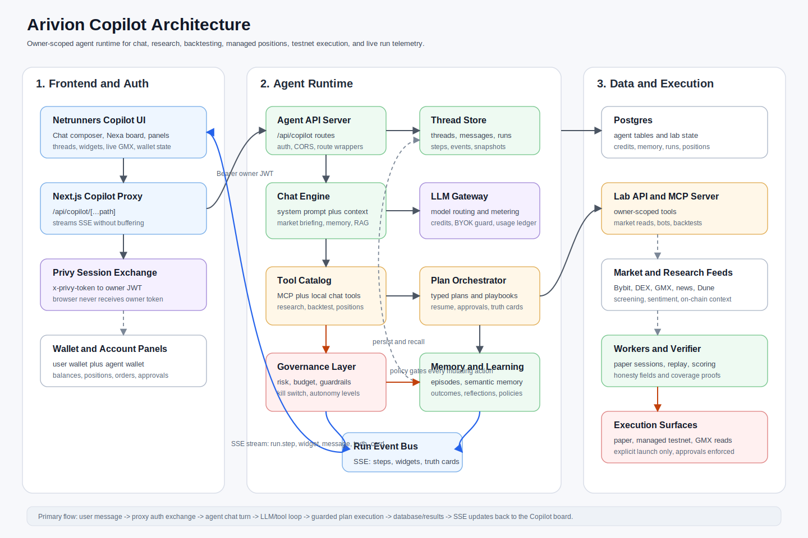

# Arivion

Arivion is an agentic quant lab for designing, testing, and operating crypto trading systems across centralized and on-chain venues. The repository combines a Next.js command interface with Python and TypeScript services for market ingestion, strategy simulation, paper execution, verification, and portfolio analytics.

## What is inside

- `frontend/` - Next.js interface for the trading cockpit, wallet-connected flows, dashboards, and strategy views.
- `netrunner quant lab/apps/` - API, worker, verifier, sandbox runner, data ingestor, and agent service code.
- `netrunner quant lab/packages/` - Shared quant, strategy, UI, connector, and type packages.
- `netrunner quant lab/contracts/` - Smart contract workspace and Foundry configuration.
- `netrunner quant lab/infra/` - Local Docker Compose infrastructure for development services.
- `netrunner quant lab/tests/` - Golden, load, and integration-oriented test coverage.

## Copilot Architecture



## Frontend

```bash
cd frontend
npm install
npm run dev
```

The frontend runs as a Next.js app. Use `npm run build` to create a production build and `npm run lint` to run the configured lint checks.

## Quant Lab

```bash
cd "netrunner quant lab"
pnpm install
pnpm test
```

The lab is organized as a PNPM workspace with Python services alongside TypeScript packages. Local infrastructure files live under `infra/` for API, worker, database, and cache workflows.

## Environment

Copy the provided example environment file before running services:

```bash
cp "netrunner quant lab/.env.example" "netrunner quant lab/.env"
```

Keep private keys, API tokens, RPC URLs, and database credentials in local environment files only. They are intentionally ignored by Git.

## Notes

Generated dependencies, build outputs, local caches, compiled Python files, and old planning artifacts are excluded from the repository so the source history stays focused and portable.
